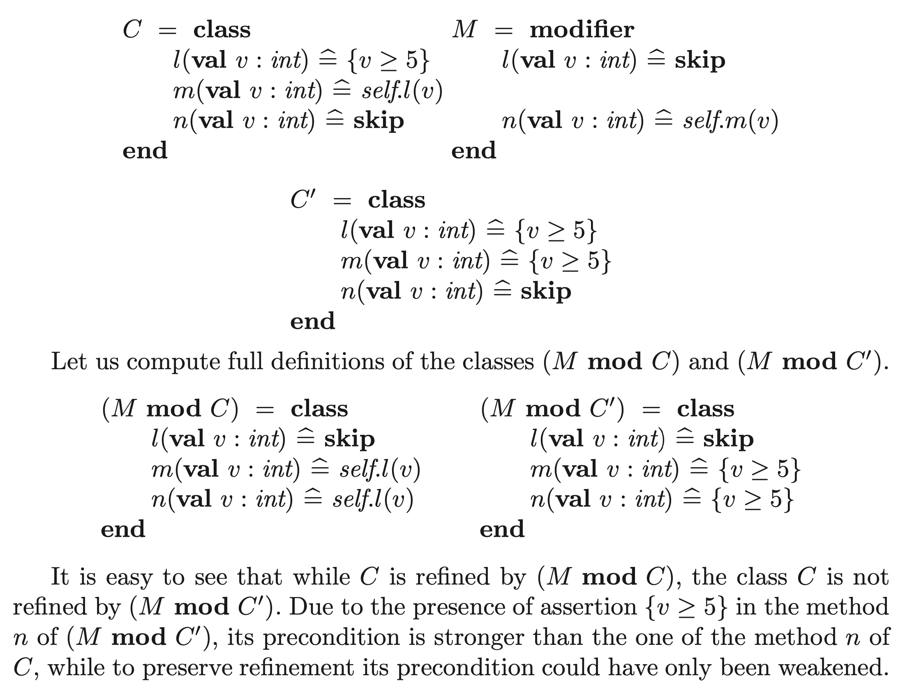

# Implementation inlining refactoring analysis — Design document

This analysis is inspired by the paper [A Study of the Fragile Base Class Problem](https://www.researchgate.net/publication/248590657_A_Study_of_the_Fragile_Base_Class_Problem), specifically by the example `3.3 Unjustified Assumptions in Modifier`.

## Problem description

The original paper states the problem as follows:



After the revision of `C`, the behavior of `C'` is the same as it was before, but the behavior of `(M mod C)` is now different. It was expected that the modifier weakens the contract, but after the revision the contract is not weakened for methods `m` and `n`.

In the next section the problem is translated into C++, then in EO and finally a solution in EO is proposed.

### C++ example

The following examples are implemented in C++ and compiled via gcc 11.2 hosted at https://compiler-explorer.com with the following compiler flags:

```
--std=c++20 -Wall -Werror -Wpedantic -Wextra -Wconversion
```

#### Base example

[Base example](https://compiler-explorer.com/z/Kq4Mb46cc).

```cpp
#include <iostream>
#include <cassert>

struct ICharacterCapabilities {
  virtual void checkMana(long mana) = 0;
  virtual void castSpell(long mana) = 0;
  virtual void attack(long mana) = 0;

  virtual ~ICharacterCapabilities() {};
};

class CharacterOps : virtual public ICharacterCapabilities {
public:
  virtual void checkMana(long mana) override {
    std::cout << "Checking character's mana" << "\n";
    assert(mana > 0);
  }

  virtual void castSpell(long mana) override {
    checkMana(mana);
    std::cout
      << "Character with " << mana
      << " mana casts a spell" << "\n";
  }

  virtual void attack(long mana) override {
    std::cout
      << "Character with " << mana
      << " mana attacks" << "\n";
  }

  virtual ~CharacterOps() {};
};

class GodModeCharacterOps : virtual public CharacterOps {
public:
  virtual void checkMana(long /*mana*/) override {
    std::cout << "The God has unlimited mana" << "\n";
  }

  virtual void attack(long mana) override {
    castSpell(mana);
  }

  virtual ~GodModeCharacterOps() {};
};

int main()
{
  long mana = 10;

  std::cout << "Regular character:" << "\n";

  CharacterOps* charOps = new CharacterOps();
  charOps->castSpell(mana);
  mana -= 5;
  charOps->attack(mana);
  delete charOps;

  std::cout << "\n" << "God character:" << "\n";

  charOps = new GodModeCharacterOps();
  charOps->castSpell(mana);
  charOps->attack(mana);
  delete charOps;

  return 0;
}
```

Output:

```
Regular character:
Checking character's mana
Character with 10 mana casts a spell
Character with 5 mana attacks

God character:
The God has unlimited mana
Character with 5 mana casts a spell
The God has unlimited mana
Character with 5 mana casts a spell
```

#### Revision

When the behavioral part of the implementation of `CharacterOps::checkMana` (i.e. `assert(mana > 0);`) [is inlined](https://compiler-explorer.com/z/f3q78GYs5) to the `CharacterOps::castSpell` instead of `checkMana(mana);`, the behavior of instance of the derived class changes.

```cpp
class CharacterOps : virtual public ICharacterCapabilities {
public:
  // ...
  virtual void castSpell(long mana) override {
    assert(mana > 0); // inlined
    std::cout
      << "Character with " << mana
      << " mana casts a spell" << "\n";
  }
  // ...
};
```

Output:

```
Regular character:
Character with 10 mana casts a spell
Character with 5 mana attacks

God character:
Character with 5 mana casts a spell
Character with 5 mana casts a spell
```

### EO example

- [ ] TODO

## Proposed solution (analysis description)

- [ ] TODO

### False positive

- [ ] TODO

### False negative

- [ ] TODO
